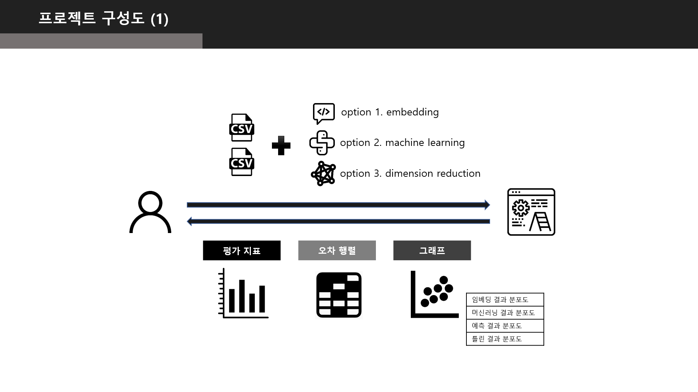
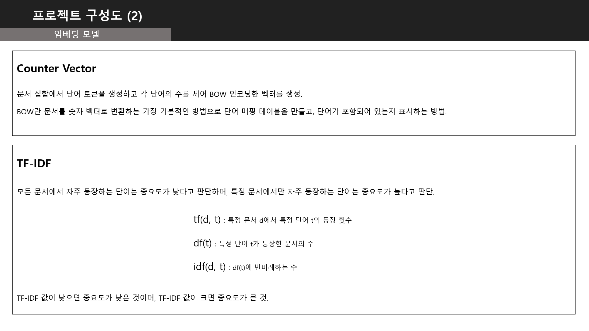
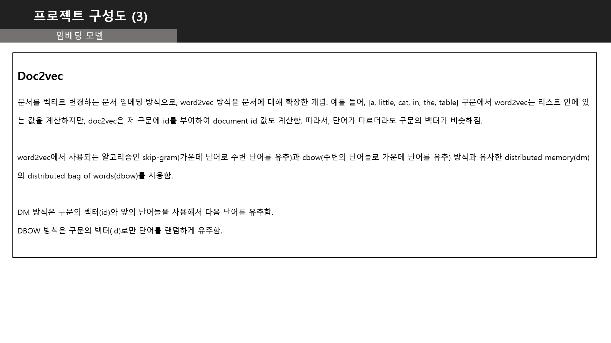
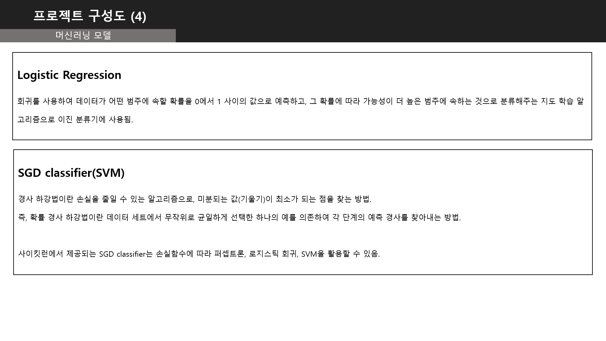
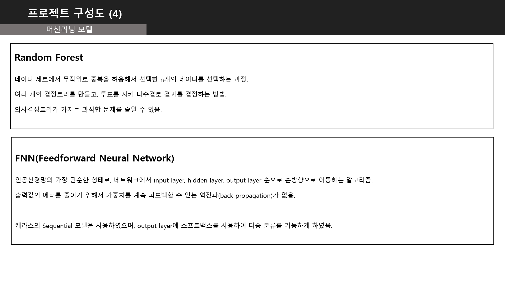
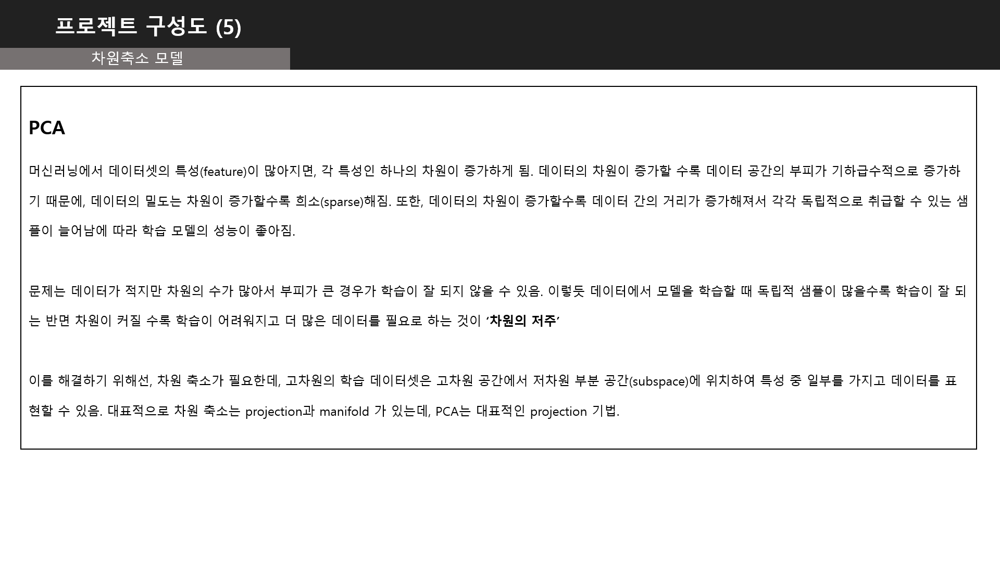
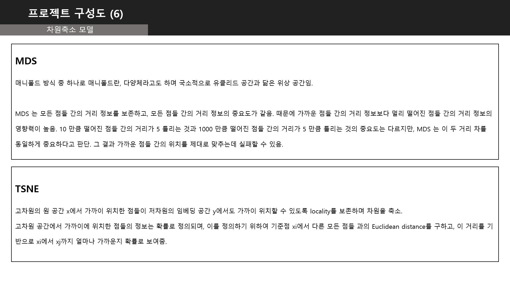

Daumsoft AI Lab Internship Project
====
  
## Machine Learning Classification Model Visualization Web Service
프로젝트명은 머신러닝 분류 모델 시각화 웹 서비스로, 사용자가 분류해보고 싶은 전처리된 파일을 가지고 임베딩 모델과 머신러닝 모델, 
차원축소 모델을 선택하여 생성된 결과를 시각적으로 보여주는 웹 서비스입니다.

일반인들뿐만 아니라 머신러닝 지식을 가지고 있는 사용자들이 직접 코드를 짜서 분류 모델을 만드는 것은 많은 시간이 소요되기 때문에 
이를 쉽게 도와줄 수 있는 서비스가 필요하다는 것을 바탕으로 시작하였습니다.

데이터 전처리 이후의 시각화를 통해 전처리가 얼마나 잘 되었는지를 육안으로 확인할 수 있으며, 선택된 임베딩과 머신러닝 방법에 
따른 각기 다른 시각화 결과를 보면서 성능 파악가능합니다.

프로젝트 구성도
------

### 1. 프로젝트 구성도

### 2. 임베딩 모델 1 (사용자가 선택할 수 있는 임베딩 모델의 간략한 설명)

### 3. 임베딩 모델 2 (사용자가 선택할 수 있는 임베딩 모델의 간략한 설명)

### 4. 머신러닝 모델 1 (사용자가 선택할 수 있는 머신러닝 모델의 간략한 설명)

### 5. 머신러닝 모델 2 (사용자가 선택할 수 있는 머신러닝 모델의 간략한 설명)

### 6. 차원축소 모델 1 (사용자가 선택할 수 있는 차원축소 모델의 간략한 설명)

### 7. 차원축소 모델 2 (사용자가 선택할 수 있는 차원축소 모델의 간략한 설명)

수행 URL
------
[Service Web Page]()